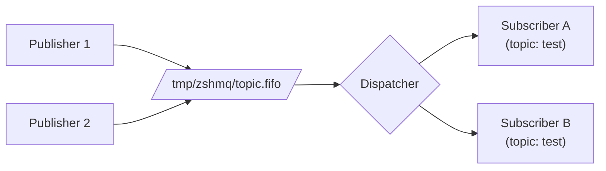
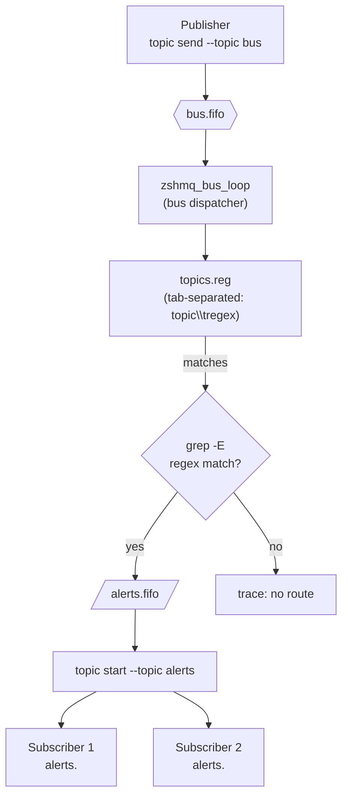

# Zero Shell Message Queue (zshmq)

**Zero Shell Message Queue (zshmq)** is a lightweight, [ZeroMQ](https://zeromq.org/)-inspired **message topic for POSIX shells**.
It provides a simple **publish/subscribe** mechanism using only **FIFOs (named pipes)** - no sockets, daemons, or dependencies.

> Think of it as *ZeroMQ for the Unix shell* - pure inter-process messaging built entirely with standard POSIX tools.

---

## Overview

- **Pure POSIX:** Works anywhere `sh`, `mkfifo`, and `read` exist.
- **Publish/Subscribe:** Multiple publishers and dynamic subscribers.
- **Zero dependencies:** Uses only core Unix utilities.
- **Efficient:** Blocking FIFO I/O -> near-zero CPU when idle.
- **ZeroMQ-like CLI:** Familiar commands (`topic start`, `topic send`, `topic sub`, etc.).
- **Fan-out bus:** Optional router that forwards a single message to multiple topics based on regex rules.
- **Tiny:** A single portable shell script.

---

## Motivation

ZeroMQ is great - but sometimes you just need **inter-process messaging** between shell scripts, without compiling or linking anything.

`zshmq` brings the same conceptual model - **topics**, **publishers**, and **subscribers** - into pure shell territory.

It's perfect for:
- Event-driven shell workflows  
- Lightweight coordination between processes  
- Teaching message-passing fundamentals  

---

## Requirements

| Component | Requirement |
|------------|-------------|
| Shell | POSIX-compliant (`bash`, `dash`, `zsh`, `ksh`, etc.) |
| Tools | Core POSIX utilities (`mkfifo`, `grep`, `cat`, `awk`, `read`, `kill`, `rm`) bundled with your shell environment; any extras ship as Git submodules |
| OS | Linux, macOS, BSD - any Unix with FIFOs |

---

## Architecture

### Topic Dispatch Loop



- Publishers write messages into `/tmp/zshmq/topic.fifo`.
- The dispatcher (`topic start`) reads frames and forwards them to subscriber FIFOs registered in `/tmp/zshmq/topic.state`.
- Each subscriber owns a dedicated FIFO (`/tmp/zshmq/topic.<pid>`) so delivery is fan-out by default.

### Bus Regex Routing



- `bus new` provisions the special `bus` topic and ensures the `topics.reg` registry exists with a `bus` placeholder entry.
- `topic new -T <topic> --regex '<pattern>'` appends or replaces that topic's regex in `topics.reg` using tab-separated rows (`topic<TAB>regex`).
- `bus start` launches `zshmq_bus_loop`, which tails `bus.fifo`, filters `PUB|bus|...` frames, and for every registry entry runs `grep -E` against the message payload.
- Matching topics are published via `bus_publish_to_topic`, which requires their dispatcher PID to be healthy before writing `PUB|topic|message` into the topic FIFO.
- Topic dispatchers fan the message out to subscribers the same way as the direct topic workflow; unmatched payloads only emit TRACE diagnostics so default executions stay silent.

## Installation

Clone and install manually:
```bash
git clone https://github.com/mparkachov/zshmq.git
cd zshmq
make release
sudo cp ./zshmq /usr/local/bin/zshmq
```

Or run locally:
```bash
zshmq <command> ...
```

## Development Guidelines

- Initialize tool dependencies with `git submodule update --init --recursive`; every non-shell helper ships as a Git submodule.
- Assume only a POSIX shell exists on the host; vendor any additional tooling through submodules.
- Name new functions after their ZeroMQ counterparts (or close equivalents) to signal behavioral parity.

## Testing

Bootstrap vendored tooling and scaffolding:
```sh
make bootstrap
```

Run the ShellSpec suite:
```sh
make test
```
By default the suite executes with `/bin/sh`. Override via `make test SHELLSPEC_SHELL=path/to/shell`.

Generate a JUnit report (ensure `tmp/reports` exists first):
```sh
mkdir -p tmp/reports
make test SHELLSPEC_FLAGS="--format progress --output junit --reportdir tmp/reports"
```
The report will be written to `tmp/reports/results_junit.xml` and published automatically by CI.

Build a release artifact using the version recorded in `VERSION` (update the file manually when bumping releases):
```sh
make release
```
This creates a self-contained `zshmq` that embeds all library code without modifying `VERSION`.

### Supported Make Targets
- `make bootstrap`
- `make test`
- `make release`

## Usage
List available commands (each supports `-h/--help` plus `-d/--debug` and `-t/--trace` for logging control):
```sh
zshmq --help
```

Show command-specific usage:
```sh
zshmq help ctx
```

### Step 1: Bootstrap Runtime
```bash
zshmq ctx new
```
Initialise the runtime directory (default `/tmp/zshmq`). Run this once per environment before creating topics or after cleaning up old sessions.

### Step 2: Create Topic Assets
```bash
zshmq topic new -T topic [--regex REGEX]
```
Creates the FIFO (`topic.fifo`) and state file (`topic.state`) used by the dispatcher. Repeat for each topic you plan to route. When the routing bus is enabled (see below), supply `--regex` to register the topic's fan-out rule in the shared `topics.reg` registry; leave the regex empty to opt out of bus deliveries for that topic.

### Step 3: Start Dispatcher
```bash
zshmq topic start --topic topic
```
Runs the router that listens for messages and subscription updates. This command expects `zshmq ctx new` to have prepared the runtime directory first and will exit with an error if the context is missing. Supply `--topic` to decide which FIFO/topic name the dispatcher should service.
Pass `--foreground` (or `-f`) to keep the dispatcher attached to the current terminal; press `Ctrl+C` to stop it and clean up the PID file.

### Optional: Configure the Routing Bus
The `bus` command provides a central fan-out dispatcher that reads messages from the special `bus` topic and forwards them to every topic whose registry regex matches the payload. Standard topic workflows (`topic new`, `topic start`, `topic send`, `topic sub`) operate entirely without the bus, so you only need these commands when you want regex-based fan-out.

```bash
# Run once per runtime to provision the bus topic and registry entry
zshmq bus new

# Launch the bus dispatcher (runs in the background by default)
zshmq bus start

# Register a topic and its matching rule
zshmq topic new -T alerts --regex 'ALERT'
zshmq topic start --topic alerts

# Publish via the bus; any matching topics receive the message concurrently
zshmq topic send --topic bus "ALERT system down"
```
Update a topic's regex by re-running `zshmq topic new -T <topic> --regex '<pattern>'`. Destroying a topic (or running `zshmq bus destroy`) removes its registry entry automatically. Restarting is optional: the bus reloads `topics.reg` on every message so changes apply immediately.

### Step 4: Subscribe to a Topic
```bash
zshmq topic sub --topic topic
```
Creates /tmp/zshmq/topic.<pid>. Enable `-d/--debug` if you need connection logs; messages for the topic stream to stdout:

system overload

The command runs until you interrupt it (Ctrl+C). On exit it deregisters from the dispatcher so future messages stop flowing to your FIFO.

### Step 5: Publish Messages
```bash
zshmq topic send --topic topic "system overload"
zshmq topic send --topic topic "cooling active"
```
Messages are routed to every subscriber registered on the `topic` topic. Success is reported through the logger; enable TRACE logging (`-t`/`--trace`) to capture full routing details.

### Step 6: List Active Subscribers
```bash
zshmq list
```
Example output:

PID     FIFO
2314    /tmp/zshmq/topic.2314
2318    /tmp/zshmq/topic.2318

### Step 7: Unsubscribe
```bash
zshmq unsub
```
Removes your FIFO and deregisters from the dispatcher.

### Step 8: Stop Dispatcher
```bash
zshmq topic stop --topic topic
```
Gracefully terminates the router for the supplied topic and cleans up /tmp/zshmq/topic.fifo.

### Step 9: Destroy Runtime (optional)
```bash
zshmq ctx destroy
```
Removes `/tmp/zshmq` (or the directory specified with `--path` / `$ZSHMQ_CTX_ROOT`). Use `--force` if additional files remain inside the runtime directory. Run `zshmq topic destroy -T <topic>` first if you only need to clean up specific topic assets.

### Command Reference

| Command | Description |
| --- | --- |
| `zshmq ctx new [--path PATH]` | Create or reset the runtime directory (default: `/tmp/zshmq`). |
| `zshmq ctx destroy [--force]` | Remove the runtime directory; use `--force` to delete non-empty directories. |
| `zshmq bus new [--path PATH]` | Provision the special bus topic and ensure it appears in `topics.reg`. |
| `zshmq bus start [--path PATH]` | Start the bus dispatcher (use `--foreground` to stay attached to the terminal). |
| `zshmq bus stop [--path PATH]` | Stop the bus dispatcher. |
| `zshmq bus destroy [--path PATH]` | Remove the bus topic and its registry entry. |
| `zshmq topic new -T <topic> [--regex REGEX]` | Create/update the FIFO/state pair and register the topic's bus regex (omit or leave empty to disable forwarding). |
| `zshmq topic destroy -T <topic> [--regex REGEX]` | Remove the FIFO/state pair and drop the registry entry. |
| `zshmq topic start --topic <topic>` | Start the dispatcher process (use `--foreground` to stay attached to the terminal). |
| `zshmq topic send --topic <topic> <message>` | Publish a message for the topic. |
| `zshmq topic sub --topic <topic>` | Subscribe to messages on the topic. |
| `zshmq list` | Show active subscribers. |
| `zshmq unsub` | Unregister the current subscriber. |
| `zshmq topic stop --topic <topic>` | Stop the dispatcher for a topic. |
| `zshmq --help` | Show usage. |
| `zshmq --version` | Display version info. |

### Environment Variables

| Variable | Default | Description |
| --- | --- | --- |
| `ZSHMQ_CTX_ROOT` | `/tmp/zshmq` | Root directory initialised by `ctx new`. |
| `ZSHMQ_TOPIC` | `/tmp/zshmq/topic.fifo` | Main topic FIFO path. |
| `ZSHMQ_STATE` | `/tmp/zshmq/topic.state` | Subscription table. |
| `ZSHMQ_TOPIC_PID` | `/tmp/zshmq/topic.pid` | PID file tracked by `topic start/stop` (falls back to `ZSHMQ_DISPATCH_PID`). |
| `ZSHMQ_DISPATCH_PID` | `-` | Deprecated alias for `ZSHMQ_TOPIC_PID` (retained for backwards compatibility). |
| `ZSHMQ_LOG_LEVEL` | `INFO` | Minimum log level emitted by the logger (TRACE, DEBUG, INFO, WARN, ERROR, FATAL); overridden by `-d/--debug` and `-t/--trace`. |

### Example Session

Terminal 1 - Setup
```bash
zshmq ctx new
zshmq topic new -T topic
```

Terminal 2 - Dispatcher
```bash
zshmq topic start --topic topic
```

Terminal 3 - Subscriber
```bash
zshmq topic sub --topic topic
```

Terminal 4 - Publisher
```bash
zshmq topic send --topic topic "Disk full"
zshmq topic send --topic topic "Backup started"
```

Subscriber Output
```bash
    ALERT: Disk full
```
## Implementation Summary

- Dispatcher uses a blocking read on /tmp/zshmq/topic.fifo (no polling).
- Subscriptions stored in /tmp/zshmq/topic.state with one FIFO per line.
- Subscribers each have a private FIFO (/tmp/zshmq/<topic>.<pid>).
- Multiple publishers supported (atomic writes up to PIPE_BUF).
- Fully POSIX; no arrays or Bash-specific syntax.

## Limitations

- One reader per FIFO (FIFO property).
- No guaranteed delivery or message persistence.
- No message-level filtering; dispatch is scoped entirely by topic.
- Single host only (no networking).
- Single broker per machine because all instances share the /tmp/zshmq/ directory.

## Roadmap

- Implement REQ/REP and PUSH/PULL patterns
- Add persistence and re-delivery
- Add metrics and TTLs
- Optional Unix-socket backend

## Design Philosophy

| Principle | Description |
| --- | --- |
| Zero dependencies | Pure POSIX implementation. |
| Brokerless | Simple dispatcher; no background services. |
| Transparent messages | Human-readable text. |
| Efficient | Blocking I/O, near-zero CPU when idle. |
| Educational | Teaches message-passing concepts with FIFOs. |

## License

MIT License (c) 2025 - Maxim Parkachov

## Inspiration

- [ZeroMQ](https://zeromq.org/) - distributed messaging patterns
- [Plan 9 Plumber](https://9p.io/sys/doc/plumb.html) - pattern-based routing
- [The Unix philosophy](https://en.wikipedia.org/wiki/Unix_philosophy) - composability through pipes
