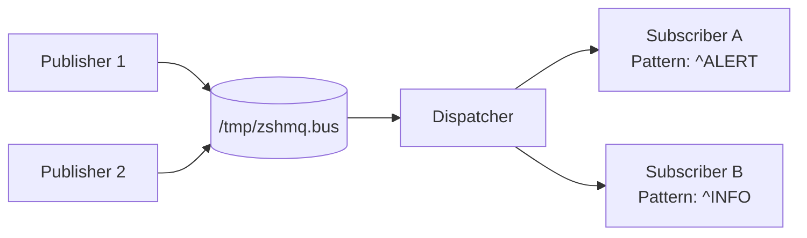

# 🌀 Zero Shell Message Queue (zshmq)

**Zero Shell Message Queue (zshmq)** is a lightweight, [ZeroMQ](https://zeromq.org/)-inspired **message bus for POSIX shells**.  
It provides a simple **publish/subscribe** mechanism using only **FIFOs (named pipes)** — no sockets, daemons, or dependencies.

> 💬 Think of it as *ZeroMQ for the Unix shell* — pure inter-process messaging built entirely with standard POSIX tools.

---

## 🚀 Overview

- 🧩 **Pure POSIX:** Works anywhere `sh`, `mkfifo`, and `read` exist.  
- 💬 **Publish/Subscribe:** Multiple publishers and dynamic subscribers.  
- ⚙️ **Zero dependencies:** Uses only core Unix utilities.  
- 💤 **Efficient:** Blocking FIFO I/O → near-zero CPU when idle.  
- 🧠 **ZeroMQ-like CLI:** Familiar commands (`pub`, `sub`, `dispatch`, etc.).  
- 🪶 **Tiny:** A single portable shell script.

---

## 🧠 Motivation

ZeroMQ is great — but sometimes you just need **inter-process messaging** between shell scripts, without compiling or linking anything.

`zshmq` brings the same conceptual model — **topics**, **publishers**, and **subscribers** — into pure shell territory.

It’s perfect for:
- Event-driven shell workflows  
- Lightweight coordination between processes  
- Teaching message-passing fundamentals  

---

## ⚙️ Requirements

| Component | Requirement |
|------------|-------------|
| Shell | POSIX-compliant (`bash`, `dash`, `zsh`, `ksh`, etc.) |
| Tools | `mkfifo`, `grep`, `cat`, `awk`, `read`, `kill`, `rm` |
| OS | Linux, macOS, BSD — any Unix with FIFOs |

---

## 🧩 Architecture



- Publishers write messages into /tmp/zshmq.bus.
- The Dispatcher reads messages and routes them to subscribers whose patterns match.
- Each Subscriber owns its own FIFO (e.g. /tmp/zshmq.sub.<pid>).

## 🧰 Installation

Clone and install manually:
```bash
git clone https://github.com/mparkachov/zshmq.git
cd zshmq
chmod +x zshmq
sudo cp zshmq /usr/local/bin/
```

Or run locally:
```bash
./zshmq <command> ...
```

## 🖥️ Usage
### 1️⃣ Initialize
```bash
zshmq init
```
Creates /tmp/zshmq.bus and the state file for subscriptions.

### 2️⃣ Start Dispatcher
```bash
zshmq dispatch
```
Runs the router that listens for messages and subscription updates.

### 3️⃣ Subscribe to a Topic
```bash
zshmq sub '^ALERT'
```
Creates /tmp/zshmq.sub.<pid> and prints matching messages:

Subscribed to '^ALERT'
ALERT: CPU overload

### 4️⃣ Publish Messages
```bash
zshmq pub "ALERT: CPU overload"
zshmq pub "INFO: Cooling active"
```
Messages are routed to subscribers with matching filters.

### 5️⃣ List Active Subscribers
```bash
zshmq list
```
Example output:

PID     FIFO                   PATTERN
2314    /tmp/zshmq.sub.2314    ^ALERT
2318    /tmp/zshmq.sub.2318    ^INFO

### 6️⃣ Unsubscribe
```bash
zshmq unsub
```
Removes your FIFO and deregisters from the dispatcher.

### 7️⃣ Stop Dispatcher
```bash
zshmq stop
```
Gracefully terminates the router and cleans up /tmp/zshmq.bus.

### 🧩 Command Reference
Command	Description
zshmq init	Initialize FIFO bus and state file
zshmq dispatch	Start the dispatcher process
zshmq pub <message>	Publish a message
zshmq sub <pattern>	Subscribe to matching messages
zshmq list	Show active subscribers
zshmq unsub	Unregister the current subscriber
zshmq stop	Stop the dispatcher
zshmq --help	Show usage
zshmq --version	Display version info

### ⚙️ Environment Variables
Variable	Default	Description
ZSHMQ_BUS	/tmp/zshmq.bus	Main FIFO path
ZSHMQ_STATE	/tmp/zshmq.state	Subscription table
ZSHMQ_DEBUG	0	Verbose mode flag

### 💡 Example Session

Terminal 1 – Dispatcher
```bash
zshmq dispatch
```

Terminal 2 – Subscriber
```bash
zshmq sub '^ALERT'
```

Terminal 3 – Publisher
```bash
zshmq pub "ALERT: Disk full"
zshmq pub "INFO: Backup started"
```

Subscriber Output
```bash
ALERT: Disk full
```
## 🧠 Implementation Summary

- Dispatcher uses a blocking read on /tmp/zshmq.bus (no polling).
- Subscriptions stored in /tmp/zshmq.state as PATTERN|FIFO.
- Subscribers each have a private FIFO (/tmp/zshmq.sub.<pid>).
- Multiple publishers supported (atomic writes up to PIPE_BUF).
- Fully POSIX; no arrays or Bash-specific syntax.

## ⚠️ Limitations

- One reader per FIFO (FIFO property).
- No guaranteed delivery or message persistence.
- Filtering uses shell patterns (case), not full regex.
- Single host only (no networking).

🧭 Roadmap

- Implement REQ/REP and PUSH/PULL patterns
- Add persistence and re-delivery
- Add metrics and TTLs
- Optional Unix-socket backend

## 🧩 Design Philosophy

**Principle	Description**
Zero dependencies	Pure POSIX implementation
Brokerless	Simple dispatcher; no background services
Transparent messages	Human-readable text
Efficient	Blocking I/O, 0 % CPU idle
Educational	Teaches message-passing concepts with FIFOs

## 📜 License

MIT License © 2025 — Maxim Parkachov

## 💬 Inspiration

[ZeroMQ](https://zeromq.org/)  — distributed messaging patterns
[Plan 9 Plumber](https://9p.io/sys/doc/plumb.html)  — pattern-based routing
[The Unix philosophy](https://en.wikipedia.org/wiki/Unix_philosophy)  — composability through pipes
